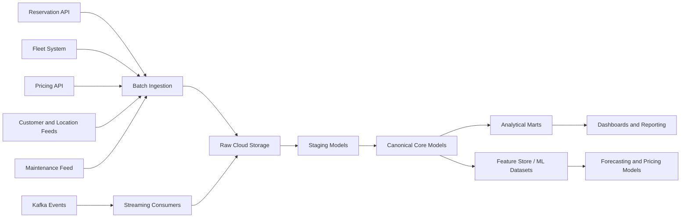
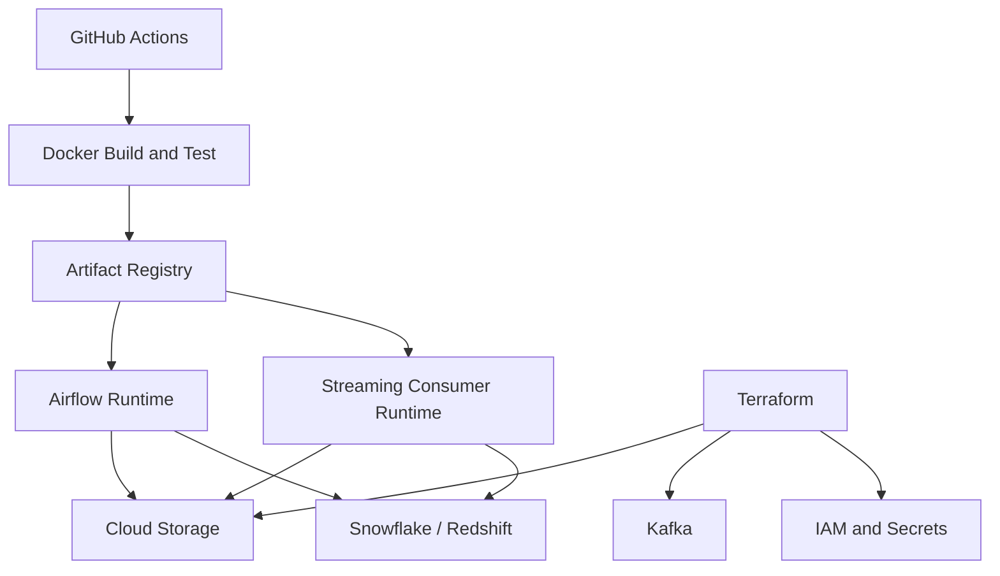

# Architecture

## Objective

The platform provides a unified analytical backbone for a car rental business by combining batch ingestion, event-driven processing, warehouse modeling, and forecast-oriented feature generation. It is designed to balance operational freshness with reproducibility, auditability, and governance.

## System Layers

### 1. Source Systems

Source domains include:

- Reservation APIs for booking lifecycle events
- Fleet systems for vehicle inventory and availability
- Pricing platforms for rates, overrides, and discounts
- Customer systems for profiles and loyalty segmentation
- Location master data feeds
- Maintenance or work-order systems
- File-based supplemental feeds from finance or partners
- Kafka topics for near-real-time booking, fleet, and pricing events

### 2. Ingestion Layer

Batch connectors under `src/ingestion/` are responsible for:

- Incremental extraction using high-watermarks
- API pagination and retry logic
- File parsing and schema validation
- Raw payload persistence
- Run metadata capture

Streaming processors under `src/streaming/` handle:

- Event contract validation
- Event-time normalization
- Deduplication and dead-letter routing
- Raw event persistence and standardized event output

### 3. Raw Landing Zone

All upstream payloads land in object storage before transformation. This pattern is used because it:

- preserves an immutable audit trail
- decouples extraction from transformation
- supports deterministic replay and backfill
- reduces dependency on upstream API availability during reprocessing

Raw partitioning should be aligned to source, entity, and ingestion time.

### 4. Standardization Layer

Staging models normalize:

- timestamps and time zones
- source identifiers
- enums and status values
- currencies and numeric types
- schema drift between provider versions

This layer intentionally stays close to the source shape while making downstream processing reliable.

### 5. Canonical Core Layer

Core models define enterprise entities and business rules:

- booking lifecycle semantics
- vehicle master and status history
- location hierarchy
- customer identity and segmentation
- pricing event history
- maintenance windows and downtime

The goal is to isolate source-specific complexity from analytical consumption.

### 6. Analytical Warehouse Layer

The warehouse publishes dimensional marts optimized for:

- fleet utilization
- booking analytics
- revenue reporting
- pricing effectiveness
- maintenance impact
- demand forecasting features

Snowflake is the reference warehouse in this design because of its support for elastic compute, semi-structured ingestion, and SQL-based analytics engineering. The SQL patterns remain portable enough to adapt to Redshift with modest changes.

### 7. Semantic and Reporting Layer

Operational, finance, and executive dashboards consume curated marts. Metric definitions are documented centrally in [dashboards/metrics.md](dashboards/metrics.md) to avoid inconsistent KPI logic across teams.

### 8. ML and Forecasting Layer

The ML layer produces feature snapshots and demand forecasts at the location-by-vehicle-class-by-date grain. It is intentionally separated from the canonical warehouse layer so that model experimentation does not destabilize production reporting logic.

## Architectural Decisions

### Why combine batch and streaming?

Car rental operations need both:

- low-latency event awareness for availability, pricing, and active bookings
- authoritative batch reconciliation for complete source-of-record accuracy

Streaming alone is insufficient for historical correction and source repair. Batch alone is too stale for operational visibility. The design uses both and treats late-arriving corrections as first-class.

### Why land raw data first?

Landing raw data before transformation enables:

- replay after downstream code changes
- schema evolution management
- forensic investigation of data incidents
- separation of duties between ingestion and modeling

### Why use canonical business models?

Reservation, pricing, and fleet systems tend to encode business state differently. Canonical models provide one stable business language for analysts and downstream systems, reducing duplicated mapping logic and inconsistent KPI definitions.

## Data Flow

## Deployment View

## Reliability Model

- Ingestion jobs are idempotent and keyed by source watermark plus natural keys.
- Kafka consumers route malformed records to dead-letter outputs without blocking healthy traffic.
- Warehouse models use deterministic merge logic and date-partitioned backfills.
- Airflow orchestrates retries, failure callbacks, and source-specific recovery paths.

## Tradeoffs

- Warehouse-first transformation simplifies analytics delivery but may not be sufficient for very large replay workloads; Spark is included for scale-heavy rebuilds.
- Kafka increases complexity but improves operational freshness and portfolio realism.
- SCD2 dimensions improve historical accuracy but increase modeling and storage overhead.

## Diagram Assets

Placeholder image files live at:

- [overview.png](docs/overview.png)
- [data-flow.png](docs/data-flow.png)
- [schema.png](docs/schema.png)

They are lightweight repository assets; the Mermaid definitions above are the authoritative reviewable diagrams.
